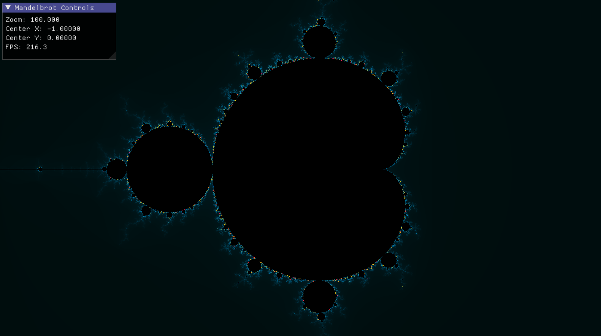
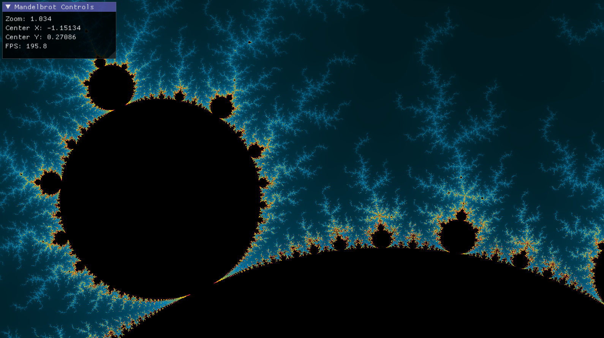
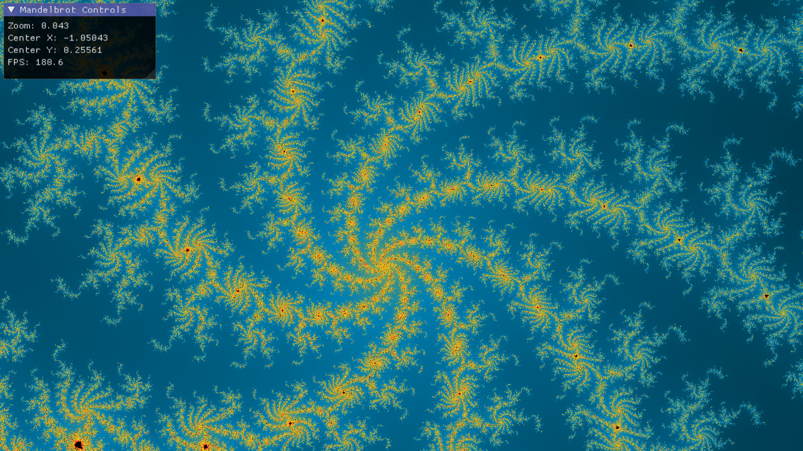

# Mandelbrot_Set

One of my first projects.  
This project renders a **Mandelbrot set** using OpenGL. 
The main purpose of the project is to implement rendering with a **compute shader**, which performs faster than a traditional fragment shader.  
I wrote it as a university research project and I'm proud of the result 😎

### Screenshots:

### Requirements
- ***GLFW*** library
- ***GLM*** library
- Compiled `glad.c`. Here is a [tutorial.](https://rpxomi.github.io/)

### 🟢 Compute Shader Advantages
- Higher FPS
- Better performance

### 🔴 Compute Shader Disadvantages
- Color rendering may be less accurate — looks better with a fragment shader
- More difficult to understand for beginners

### Reference
I am so gratefull to [**Patrick Gono!**](https://gravatar.com/patrickgono?utm_source=hovercard)
This project was inspired by his article [**Visualizing the Mandelbrot Set Using OpenGL, Part 2.**](https://physicspython.wordpress.com/2020/03/04/visualizing-the-mandelbrot-set-using-opengl-part-2/)
  
